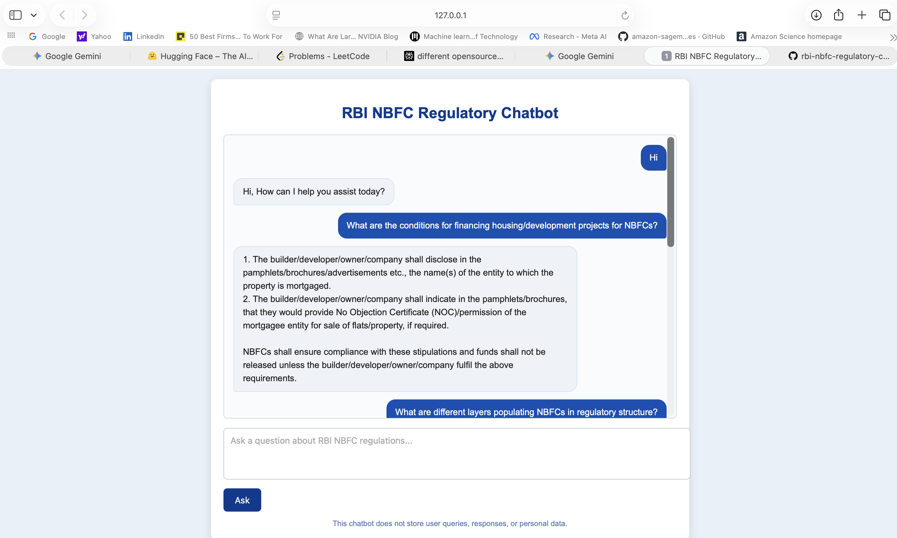

# RBI NBFC Regulatory Chatbot
A lightweight, RAG based chatbot is developed using open source LLM model (LLAMA 3.2: 3b) to answer questions strictly based on RBI regulations governing Non-Banking Financial Companies (NBFCs).

## Architecture (RAG Pipeline)

This chatbot follows a **Retrieval-Augmented Generation (RAG)** approach:

1. **User Query**
- User submits a regulatory question via the chat UI.

2. **Context Retrieval**
- Relevant RBI NBFC regulatory content is retrieved from a predefined knowledge vector database (embeddings).
- Only the retrieved context is used for response generation.

3. **Controlled Generation**
- The language model generates responses strictly limited to the provided RBI context.
- If information is not explicitly available, the system responds accordingly.

4. **Response Delivery**
- The answer is displayed to the user.
- Temporary responses are stored for better response generation.

## 🖼️ Application Screenshot

Below is a screenshot of the locally developed chatbot interface:

⚠️ The application does not store user data, chat logs, timestamps, or personal information and processes all interactions in memory.
⚠️ The system does not rely on external knowledge beyond the supplied RBI regulatory context.
